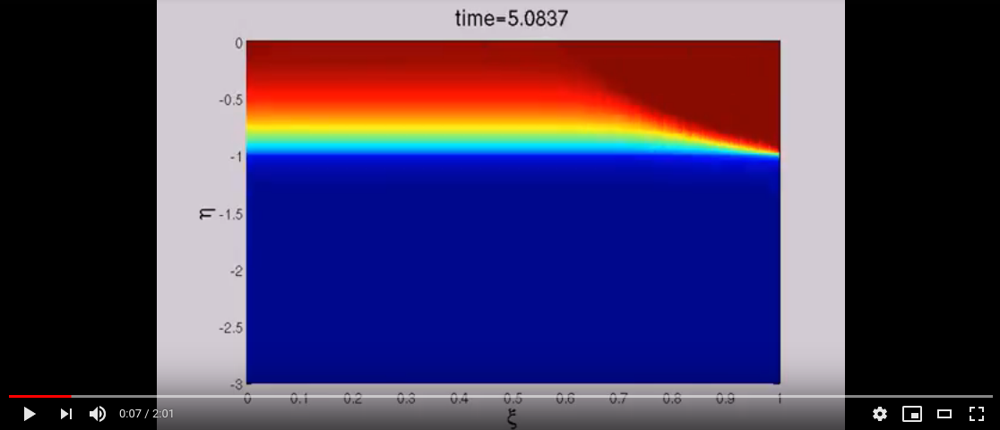

# Fast Navier-Stokes solver for 2D channel with oscillatory walls
Compile code running:
make -f fullcode.makefile (It requires the FFTW Fast Fourier Transform library)

The animation below was created from a run of the code. It shows the concentration of a chemical which is dissolved in the fluid (top of the domain) and can diffuse into the solid (bottom of the domain). The solid portion pulsates periodically, creating a fluid flow.

